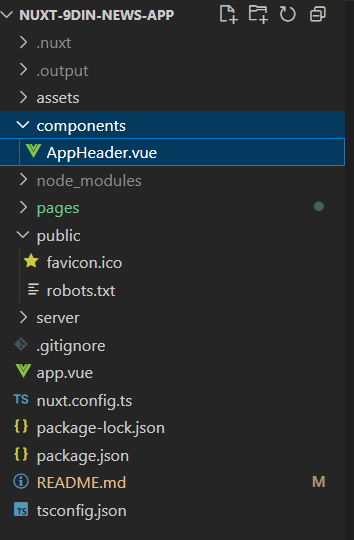

# Nuxt3 프로젝트

## Nuxt 소개
<details>
<summary>펼치기/접기</summary>
<br>

프론트엔드 시장에서 가장 많이 사용되는 라이브러리 중 하나는 React이며, 그 기반 위에서 작동하는 Next.js 프레임워크가 높은 점유율을 보이고 있다.  
그 뒤를 잇는 인기 프레임워크가 바로 Vue.js이다.  

이러한 React나 Vue.js와 같은 툴은 자바스크립트를 보다 효율적으로 활용할 수 있도록 도와주는 라이브러리이기 때문에, 기본적인 퍼포먼스 차이는 크지 않다.  
하지만 React는 Facebook이 유지보수하고 있으며, Vercel이라는 강력한 커뮤니티의 지원을 받는 만큼 생태계가 크고 공식 문서가 잘 되어 있어 많은 개발자들이 채택하고 있는 것도 사실이다.

그렇다고 Vue.js가 뒤떨어진다는 의미는 아니다. 
Vue.js 역시 직관적인 문법과 편리한 구조로 많은 개발자에게 사랑받고 있으며, 더 나아가 Vue의 기능을 확장해주는 프레임워크인 Nuxt.js가 출시되면서 Vue 생태계의 가능성은 더욱 넓어졌다.

### Nuxt 3의 등장과 확산
Nuxt 3 버전이 출시된 이후 시간이 어느 정도 흐르며, 안정적인(stable) 릴리스들도 점차 나오고 있다.  
이에 따라 Vue.js를 선호하던 개발자들도 점차 Nuxt로 넘어가는 분위기가 형성되고 있다.  

실제로 Nuxt 공식 홈페이지에 접속해 보면, Github, NASA, Google 등과 같은 글로벌 대기업들이 Nuxt를 활용하고 있다는 점에서 신뢰도를 확인할 수 있다.  

Nuxt는 **개발자의 경험(Developer Experience, DX)**을 최우선으로 고려하여 웹 개발을 보다 효과적이고 성능 중심적으로 진행할 수 있도록 도와주는 툴이다.  
누구나 쉽게 사용할 수 있으며, Vue.js의 모든 기능을 포함하고 있어 Vue를 보다 있어 보이게, 구조적으로 개발할 수 있도록 도와준다.  

### 주요 기능 소개

#### SEO(Search Engine Optimization)
Vue.js나 React는 SPA(Single Page Application) 특성상 모든 페이지가 index.html 하나로 구성되기 때문에 메타 정보를 검색 엔진에 효과적으로 전달하기 어려운 구조적 한계를 가지고 있다.  

이러한 단점을 극복한 것이 바로 Next.js와 Nuxt.js다.  
Nuxt는 SSR(Server-Side Rendering) 및 SSG(Static Site Generation)를 지원하여 SEO 문제를 자연스럽게 해결할 수 있게 도와준다.  

#### Router
Vue.js에서는 별도로 vue-router를 설치한 뒤, createRouter를 설정하고 App.vue에 <router-view /> 컴포넌트를 넣는 방식으로 라우팅 기능을 구현해야 했다.  

하지만 Nuxt에서는 별도의 설정이 필요 없다.    
pages/ 디렉토리 안에 index.vue, about.vue 등의 파일을 생성하는 것만으로도 자동으로 라우팅 처리가 된다.

또한 posts/[id].vue와 같은 파일 구조를 통해 Slug 기반의 동적 라우팅도 손쉽게 구현할 수 있다.  
이 기능은 Next.js에도 동일하게 존재한다.  

라우팅 링크는 NuxtLink 컴포넌트를 사용하여 `<a>` 태그처럼 활용할 수 있으며, `useRouter()` 훅을 통해 `router.params.id`로 라우트 파라미터에 접근할 수 있다.  
이는 상세 페이지나 게시판 구현 시, 특정 ID 값을 기준으로 API와 통신하거나 DB 데이터를 조회할 때 유용하게 활용된다.

### 개발 가이드
#### Key Concepts
Nuxt.js는 TypeScript 기반으로 개발된 프레임워크로, TypeScript와의 호환성이 뛰어나다. 
최근 대부분의 프로젝트에서 TypeScript를 기본적으로 사용하는 만큼, Nuxt도 타입 안정성과 개발 편의성을 높여준다.

#### 디렉토리 구조(Directory Structure)
Nuxt를 설치하면 아래와 같은 기본 디렉토리 구조를 자동으로 구성해준다.  
별도의 src 디렉토리 없이 최상위 디렉토리 기준으로 Nuxt가 컴파일 시 자동으로 인식한다.

- assets/  
스타일시트, 폰트, 이미지 등을 관리한다.  
정적 파일을 서버에서 직접 제공하고 싶을 경우에는 public/ 디렉토리에 넣어 빌드 시 함께 제공할 수 있다.  

- components/  
전역/공통 컴포넌트를 관리하는 디렉토리다.  
예를 들어 components/base/foo/button.vue 파일이 있을 경우, <BaseFooButton />이라는 태그로 자동 인식되며, Component Auto Import 기능을 지원한다.  

- composables/  
Composition API 기반의 재사용 가능한 로직(예: 유틸 함수)을 관리하는 디렉토리다.  

- layouts/  
Slot 기능을 이용해 외부 레이아웃 틀을 정의하는 공간이다.  
예를 들어 팝업, 다이얼로그 등 공통 레이아웃이 필요한 경우에 사용된다.  
NuxtLayout 기능을 통해 동적으로 레이아웃을 적용할 수 있다.  

</details>
<br>


## Nuxt3 프로젝트 세팅
<details>
<summary>펼치기/접기</summary>
<br>

1. 설치 명령 입력
   ```bash
   npx nuxi@latest init {프로젝트명}
   ```

2. 패키지 설치 확인 - `y 선택`
   ```bash
   Need to install the following packages:
     nuxi@3.25.1
   Ok to proceed? (y) y
   ```

3. 패키지 매니저 선택 - `npm 선택`
   ```bash
   ❯ Which package manager would you like to use?
   ● npm (current)
   ○ pnpm
   ○ yarn
   ○ bun
   ○ deno
   ```

4. 텔레메트리 참여 여부 선택 - `No 선택`
   ```bash
   ℹ Nuxt collects completely anonymous data about usage.
     This will help us improve Nuxt developer experience over time.
     Read more on https://github.com/nuxt/telemetry
   ❯ Are you interested in participating?
   ○ Yes / ● No
   ```
   > **참고**: 텔레메트리는 익명으로 사용자의 기본 환경과 행동 데이터를 수집해 Nuxt 팀이 개발자 경험을 분석하고 개선하는 데 활용하는 옵트인 기반의 데이터 수집 시스템으로, 개인정보는 수집하지 않으며, 수집된 데이터는 Nuxt 프로젝트 개선에만 사용된다.

5. Git 리포지토리 초기화 여부 선택 - `No 선택`
   ```bash
   ❯ Initialize git repository?
   ○ Yes / ● No
   ```

6. 공식 모듈 설치 여부 선택 - none(ctrl+C)
   ```bash
   ✔ Would you like to install any of the official modules?
   none
   ```

7. 설치 완료 후 서버 실행
   ```bash
   npm run dev
   ```

</details>
<br>

## NuxtWelcome과 LazyNuxtWelcome 지연로딩
<details>
<summary>펼치기/접기</summary>
<br>

NuxtJS를 설치한 후 구성되는 최상위 app.vue 컴포넌트의 template영역에 NuxtWelcome이라는 컴포넌트가 선언되어 있다.
해당 컴포넌트는 NuxtJS가 기본적으로 제공하는 컴포넌트로 [.nuxt/components.d.ts](.nuxt/components.d.ts) 파일에 등록된 컴포넌트이다.  
_GlobalComponents interface를 보면 해당 컴포넌트 외에도 다른 컴포넌트들이 있는것을 확인할 수 있다.

```ts
interface _GlobalComponents {
   /* 생략 */
   'NuxtWelcome': typeof import("../node_modules/nuxt/dist/app/components/welcome.vue")['default']
   /* 생략 */
}
export const NuxtWelcome: typeof import("../node_modules/nuxt/dist/app/components/welcome.vue")['default']
```

실제 해당 컴포넌트는 [node_modules/nuxt/dist/app/components/welcome.vue](node_modules/nuxt/dist/app/components/welcome.vue) 경로에서 확인할 수 있다.

_GlobalComponents interface에 선언된 다른 기본 컴포넌트들도 NuxtWelcome과 같이 내장되어있으며 공식문서 등의 래퍼런스를 확인하여 기능을 익힐 수 있다.

추가로 해당 컴포넌트는 LazyComponent의 제네릭 타입으로 import되어 LazyNuxtWelcome이라는 이름으로도 등록되어 있다.

### LazyNuxtWelcome과 Lazy Load(지연로딩)
먼저 Lazy Load란 우리말로 지연 로딩이라고 부르며 특정 리소스(컴포넌트, 페이지 등)을 필요한 시점에 로딩하는 것을 말한다.  

js에서는 보통 import문을 최상단에 선언하여 불러오는데 해당 방식을 문법적으로는 Static import(정적 임포트) 동작 시점 측면에서는 Eager Load(즉시 로드)이라고 정의할 수 있다.

Lazy Load 지연 로딩은 해당 방법 대신 import() 함수를 사용하여 필요한 시점에 호출하여 로딩할 수 있다.

자주 쓰는 공통 컴포넌트일 경우에는 정적 Static import를 권장하지만,  
무거운 페이지 단위의 컴포넌트 혹은 Modal, Chart, Map 같은 대형 UI, 관리자 페이지와 같이  
시스템적인 설정이 필요한 자주 사용하지 않는 화면에서 사용하는 것이 바람직한 예로 볼 수 있다.  

VueJS에서도 Router import시 앞서 언급한 import() 함수를 호출하여 Lazy Load를 사용할 수 있다.
```js
const routes = [
  {
    path: '/mypage',
    component: () => import('./pages/MyPage.vue')
  }
]

```

#### 지연 로딩(Lazy Load)의 중요점
- 퍼포먼스 최적화
  - 초기 번들 크기 감소로 페이지 첫 로딩 속도가 향상된다.
    - ex) First Paint, Time to Interactive 등 개선
- 코드 스플리팅
  - webpack이나 vite는 import()를 만나면 자동으로 별도의 chunk(단위)로 분리한다.
    - ex) [즉시] app.js (안에 MyPage.js 존재) → [지연] app.js, MyPage.[hash].js 로 분리
   - 브라우저에서 요청 발생시 분리된 컴포넌트 MyPage.[hash].js 파일을 브라우저에 추가로 다운로드한다.

#### First Paint란?
웹 사이트를 열었을 때 최초로 화면이 출력되는 시점으로, 예를들어 하얀 화면만 있다가 글씨나 배경이 처음으로 출력되는 순간을 말한다.

#### Time To Interactive란?
사용자가 클릭하거나 스크롤을 할 수 있을 정도로 웹 사이트가 완전히 준비된 시점을 말한다.  
버튼이 보이지만 아직 안눌리는 상태는 아직 준비 안 된 것이며, 눌렀을 때 반응하는 시점이 바로 `Time To Interactive` 이다.

</details>
<br>

## NuxtRouteAnnouncer
<details>
<summary>펼치기/접기</summary>
<br>

NuxtJS를 설치한 후 구성되는 최상위 app.vue 컴포넌트의 template영역에 NuxtRouteAnnouncer이라는 컴포넌트가 선언되어 있다.  
해당 컴포넌트는 접근성(A11Y) 관련 내장 컴포넌트이다.  
페이지가 변경될 때 화면 리더(Screen Reader)에게 새로운 경로를 알리는 역할을 한다.  
여기서 말하는 화면 리더는 각 장애인 또는 시력이 약한 사람이 컴퓨터나 스마트폰 화면의 내용을 음성으로 듣거나 점자 디스플레이로 출력할 수 있게 도와주는 보조 기술(Assistive Technology)를 말한다.  
예를들면 시각 장애인이 사용하는 스크린 리더가 경로 변화를 인식할 수 있게 한다.   
만약 `<main>` 컨텐츠가 바뀌었음을 시각적으로 보지 못해도 음성으로 안내받을 수 있다.  
SPA 에서는 페이지 전환 시 실제로 HTML 전체가 바뀌지 않고 Vue 라우터만 바뀌기 때문에 스크린 리더는 페이지가 바뀌었다는 것을 감지하지 못하기 때문에 이러한 도우미 역할을 하는 컴포넌트이다.

해당 컴포넌트는 접근성이 필요할때 사용하는 컴포넌트 이므로 필수 컴포넌트가 아니다.

[node_modules/nuxt/dist/app/components/nuxt-route-announcer.js](node_modules/nuxt/dist/app/components/nuxt-route-announcer.js)에 존재하며 .vue 확장자가 아닌 .js 확장자로 구현된 컴포넌트이다.  


</details>
<br>

## components 디렉토리와 자동 전역 등록
<details>
<summary>펼치기/접기</summary>
<br>

NuxtJS에서는 루트 경로에 존재하는 components 디렉토리 하위의 모든 컴포넌트들을 자동으로 전역에 등록해준다.  따라서 import문 없이 자동으로 import 할 수 있다.  

```vue
<template>
  <div>
    <AppHeader />
  </div>
</template>
<script setup lang="ts">
/* AppHeader 컴포넌트를 정적 import 및 component 등록작업을 하지 않아도 출력된다! */
</script>
```

해당 기능은 다음으로 배울 pages 디렉토리 기반 라우팅 방식에서도 자동 import되어 동일하게 사용이 가능하다.

</details>
<br>

## NuxtPage와 pages 디렉토리 기반 라우팅
<details>
<summary>펼치기/접기</summary>
<br>

### 1. 중첩 라우트(index.vue)
pages 디렉토리 하위에 새로운 디렉토리를 생성하고, index.vue 라는 이름으로 컴포넌트를 생성할 경우 디렉토리 기반으로 `{locahlost:port}/bookmark` 주소로 라우팅이 된다.

- 라우팅 경로: {locahlost:port}/bookmark
- 리소스 경로: pages/bookmark/index.vue
- 하위 폴더, 하위 경로를 구조적으로 관리할 때 주로 사용하며, 유지보수와 확정성에 유리하다.
  - 예를들어 bookmark관련 컴포넌트들을 관리해야할 때 디렉토리로 분류하여 관리한다.
    - pages/bookmark/components/컴포넌트.vue
    - pages/bookmark/index.vue
    - 구조
      ```
      📂pages/
      └── 📂bookmark/
          ├── 📂components/
          │   └── 컴포넌트.vue
          └── index.vue
      ```

### 2. 단일 라우트(컴포넌트명.vue)

- 라우팅 경로: {locahlost:port}/bookmark
- 리소스 경로: pages/bookmark.vue
  - 폴더 없이 단순 파일명 기반 라우팅으로 작은 프로젝트나 단순 페이지 구성에 적합하다.
    - pages/bookmark/components/컴포넌트.vue
    - pages/bookmark.vue
    - 구조
      ```
      📂pages/
      └── bookmark.vue
      ```

<br>

- 라우팅 경로: {locahlost:port}/
- 리소스 경로: pages/index.vue
  - 폴더 없이 단순 파일명 기반 라우팅으로 작은 프로젝트나 단순 페이지 구성에 적합하다.
    - pages/index.vue
    - 구조
      ```
      📂pages/
      └── index.vue
      ```

### NuxtPage
위의 pages 디렉토리 기반 라우팅을 하기 위해서는 app.vue 컴포넌트 혹은 출력할 컴포넌트의 출력할 위치에 `<NuxtPage />` 라는 Nuxt 기본 제공 컴포넌트를 선언해야한다.
router-view와는 다르게 여러 컴포넌트에서 중복해서 사용할 수는 없다.

#### 주의점
이때 bookmark/comoponents 라는 디렉토리를 추가하여 컴포넌트를 만들경우 index.vue에서 import문을 선언하여 사용해야 한다.
루트 하위의 components가 아닌 components 디렉토리는 전역으로 등록되지 않는다.

</details>
<br>

## scss 전역 파일 상대경로 등록 및 관리 설정 - nuxt.config.ts 
<details>
<summary>펼치기/접기</summary>
<br>

1. scss npm 의존성 설치
   ```
   npm install -D sass
   ```
   - D옵션: devDependencies 포함  
      sass는 실제 사용자가 웹 페이지를 볼 때 동작하는 코드가 아니라, 개발 시점 .scss 또는 .sass 파일을 .css로 변환하는 역할을 한다.  
			즉, 브라우저에서 직접 실행되는 게 아니라, 빌드 도구(vite, Webpack등) 에서만 사용된다.  
			따라서 dependencies(운영) 대신 devDependencies(개발 빌드시 필요)에 포함시키는것이 적절하다.  
			조금 더 구체적으로 예를들어 보자면 axios같이 런타임시 지속적으로 브라우저에서 사용하는 모듈의 경우 node_modules에서 axios관련 필요한 모듈 파일들을 함께 웹패킹하여 dist로 패키징해야 하기 때문에 dependencies에 포함하지만, scss는 빌드 및 웹패킹 당시에만 컴파일하기때문에 최종 컴파일에 필요한 모듈로서 devDependencies에 포함시키는것이다.


2. nuxt.config.ts 파일에 아래 코드를 추가해준다.
   ```ts
   export default defineNuxtConfig({
		vite: {
				css: {
					preprocessorOptions: {
					scss: {
							/* 전역적으로 사용되는 css의 상대경로 등록 및 관리 */
							additionalData: '@use "@/assets/scss/global.scss" as *;'
					}
					}
				}
		}
   })
   ```

- nuxt.config.ts
   - `AS-IS`
      ```ts
      export default defineNuxtConfig({
				compatibilityDate: '2025-05-15',
				devtools: { enabled: true },
      })
      ```
   - `TO-BE`
      ```ts
      export default defineNuxtConfig({
				compatibilityDate: '2025-05-15',
				devtools: { enabled: true },
				vite: {
					css: {
							preprocessorOptions: {
							scss: {
								/* 전역적으로 사용되는 css의 상대경로 등록 및 관리 */
								additionalData: '@use "@/assets/scss/global.scss" as *;'
							}
							}
					}
				}
      })
      ```
</details>
<br>

## Pinia 설치 및 설정
<details>
<summary>펼치기/접기</summary>
<br>

### Pinia란?
Vue3의 공식 상태 관리 라이브러리이다.  
기존 Vuex의 후속(기술적 후속이지만 만든사람과 구조는 다름)이라고 볼 수 있으며, 훨씬 더 간결하고 타입친화적이고 모듈화에 유리한 구조를 가지고 있다.  

Vue는 props, emit으로 컴포넌트끼리 데이터를 전달하지만, 계층구조기 깊어질수록 복잡해진다.  
이에 Vuex가 나왔지만 문법이 복잡하고 boilerplate(반복코드)가 많았다.  
Pinia는 Vuex보다 더 단순하고 직관적인 방식으로 상태 관리를 할 수 있다. 

<br>


| 항목             | Vuex (v3/v4)                    | Pinia                             |
| -------------- | ------------------------------- | --------------------------------- |
| 사용 가능 Vue 버전   | Vue 2, 3                        | Vue 3 이상                          |
| 구조             | State, Getter, Mutation, Action | State, Getter, Action            |
| Mutation 필요 여부 | ✅ 필수                            | ❌ 필요 없음 (Action에서 직접 state 변경 가능) |
| 코드 길이          | 많고 중복됨                          | 매우 간결                             |
| TypeScript 지원  | 불완전                             | ✅ 매우 뛰어남                          |
| 모듈화 방식         | 네임스페이스                          | 함수를 통한 분리형 구조                     |

<br>

---
<br>

### Nuxt Pinia 설치 가이드

1. scss npm 의존성 설치
   ```
   npm install pinia @pinia/nuxt
   ```

2. nuxt.config.ts 파일에 아래 코드를 추가해준다.
   ```ts
   export default defineNuxtConfig({
		modules: ['@pinia/nuxt']
   })
   ```

- nuxt.config.ts
   - `AS-IS`
      ```ts
      export default defineNuxtConfig({
				compatibilityDate: '2025-05-15',
				devtools: { enabled: true },
				vite: {
					css: {
						preprocessorOptions: {
							scss: {
								/* 전역적으로 사용되는 css의 상대경로 등록 및 관리 */
								additionalData: '@use "@/assets/scss/global.scss" as *;'
							}
						}
					}
				},
			})
      ```
   - `TO-BE`
      ```ts
      export default defineNuxtConfig({
				compatibilityDate: '2025-05-15',
				devtools: { enabled: true },
				vite: {
					css: {
						preprocessorOptions: {
							scss: {
								/* 전역적으로 사용되는 css의 상대경로 등록 및 관리 */
								additionalData: '@use "@/assets/scss/global.scss" as *;'
							}
						}
					}
				},
				modules: ['@pinia/nuxt']
			})
      ```
</details>
<br>

## 전역 SCSS @import 이슈
<details>
<summary>펼치기/접기</summary>
<br>

전역으로 사용하는 scss 파일에서 다른 scss 모듈을 import 해야할 경우가 있는데, sass 버전에 따라 @import가 지원되지 않을 수 있다.  
<br>

### @import 변수 사용 3.0.0 버전 이슈 - @forward
<details>
<summary>접기/펼치기</summary>
<br>

```
Deprecation Warning [import]: Sass @import rules are deprecated and will be removed in Dart Sass 3.0.0.

More info and automated migrator: https://sass-lang.com/d/import

  ╷
1 │ @import './color';
  │         ^^^^^^^^^
  ╵
    assets\scss\global.scss 1:9  @use
    components\AppNav.vue 1:1    root stylesheet

Deprecation Warning [import]: Sass @import rules are deprecated and will be removed in Dart Sass 3.0.0.
```
</details>

<br>

위 오류는 sass 3.0.0부터 @import문법이 더이상 사용되지 않아 발생하는 문법이다.  
sass 3.0.0에서는 scss파일에 불러온 뒤 외부로 export하는 경우에는 @forward를 사용하면 된다.

### @import 변수 사용 3.0.0 버전 이슈 - @use
<details>
<summary>접기/펼치기</summary>
<br>

```
 ERROR  Internal server error: [sass] Undefined variable.                                                                                                                                                             오전 1:40:32  
   ╷
14 │     color: $color-black-700;
   │            ^^^^^^^^^^^^^^^^
   ╵
  assets\scss\global.scss 14:12  @use
  components\AppHeader.vue 1:1   root stylesheet
  Plugin: vite:css
  File: C:/Programming/workspace_vs/nuxt-9din-news-app/components/AppHeader.vue?vue&type=style&index=0&scoped=a54da7ff&lang.scss:14:12
  [sass] Undefined variable.
     ╷
  14 │     color: $color-black-700;
     │            ^^^^^^^^^^^^^^^^
     ╵
    assets\scss\global.scss 14:12  @use
    components\AppHeader.vue 1:1   root stylesheet
      at Object.wrapException (C:\Programming\workspace_vs\nuxt-9din-news-app\node_modules\sass\sass.dart.js:2302:47)
      at C:\Programming\workspace_vs\nuxt-9din-news-app\node_modules\sass\sass.dart.js:88664:23
      at _wrapJsFunctionForAsync_closure.$protected (C:\Programming\workspace_vs\nuxt-9din-news-app\node_modules\sass\sass.dart.js:4921:15)
      at _wrapJsFunctionForAsync_closure.call$2 (C:\Programming\workspace_vs\nuxt-9din-news-app\node_modules\sass\sass.dart.js:38012:12)
      at Object._asyncStartSync (C:\Programming\workspace_vs\nuxt-9din-news-app\node_modules\sass\sass.dart.js:4885:20)
      at _EvaluateVisitor2.visitVariableExpression$body$_EvaluateVisitor0 (C:\Programming\workspace_vs\nuxt-9din-news-app\node_modules\sass\sass.dart.js:88670:16)
      at _EvaluateVisitor2.visitVariableExpression$1 (C:\Programming\workspace_vs\nuxt-9din-news-app\node_modules\sass\sass.dart.js:88644:19)
      at VariableExpression0.accept$1$1 (C:\Programming\workspace_vs\nuxt-9din-news-app\node_modules\sass\sass.dart.js:124128:22)
      at VariableExpression0.accept$1 (C:\Programming\workspace_vs\nuxt-9din-news-app\node_modules\sass\sass.dart.js:124131:19)
      at C:\Programming\workspace_vs\nuxt-9din-news-app\node_modules\sass\sass.dart.js:86730:41
```

</details>
<br>

위 오류는 $color-black-700라는 변수를 불러올 수 없어 발생한 오류이다.  
sass 3.0.0에서는 `@import`문이 지원되지 않으므로 a.scss파일에서 b.scss 파일의 변수를 사용을 해야할 때는 `@use`를 사용한다.
<br>

### 대응 예시 코드
- global.scss에서 color.scss을 외부로 내보내기
   ```scss
   @forward './color';
   ```

- global.scss에서 color.scss에 정의한 변수 사용
   ```scss
   @use './color' as *;

   * {
      color: $color-black-700;
   }
   ```

- global.scss에서 color.scss에 정의한 변수 사용 - 별칭 접근
   ```scss
   @use './color' as color;

   * {
      color: color.$color-black-700;
   }
   ```

- global.scss에서 color.scss를 내보내며 동시에 정의된 변수 사용
   ```scss
   @import './color';

   @use './color' as *;

   * {
      color: $color-black-700;
   }
   ```
   ```scss
   @import './color';

   @use './color' as color;

   * {
      color: color.$color-black-700;
   }
   ```
</details>
<br>

## [SCSS 문법](markdown/SCSS.md)
<br>

## [CSS 문법](markdown/CSS.md)
<br>

## 템플릿
<details>
<summary>펼치기/접기</summary>
<br>

</details>
<br>