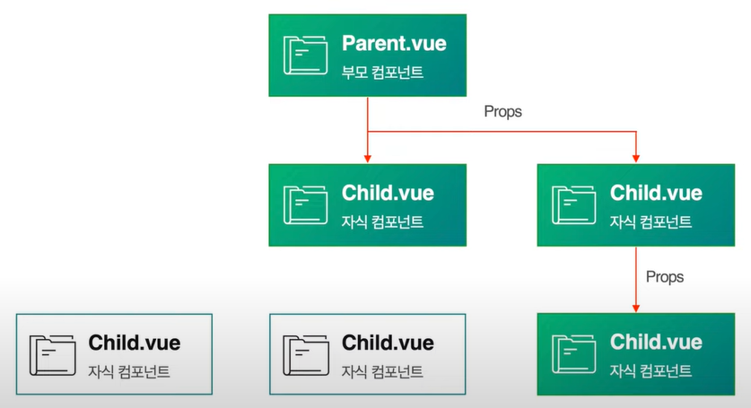
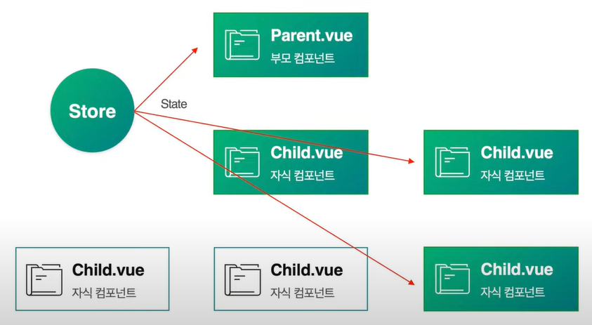
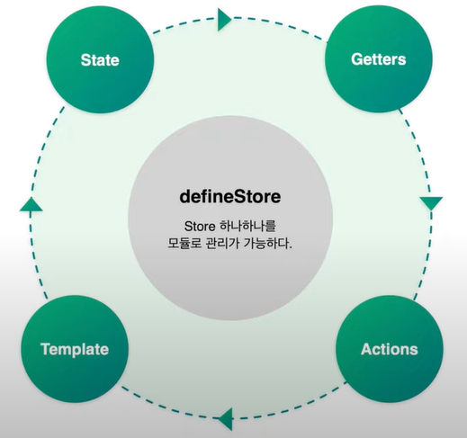

# [README.md](../README.md)

# PINIA 가이드

## Pinia란?
<details>
<summary>펼치기/접기</summary>
<br>

VueJS 3버전에 공식적으로 채택된 반응성을 가진 데이터를 효과적으로 관리할 수 있도록 도와주는 중앙 집중식 상태 관리 라이브러리이다.  


VueJS는 기본적으로 부모와 자식 컴포넌트간 props와 emits 문법을 사용하여 데이터 전달을 한다.

props를 사용할 때, 컴포넌트간의 종속관계의 깊이 즉 뎁스가 얕을 경우에는 데이터 추적이 비교적 간단한 반면,  
깊이가 깊어질수록 데이터의 흐름을 파악하는데 굉장히 시간이 오래걸리고, 유지보수가 힘들어진다.    

만약 컴포넌트간의 관계가 2depth만 되어도 데이터를 props와 emit으로 전달되는 데이터들을 추적하기 귀찬아지며,  
또 데이터를 전달할때 변수명 등을 변경하여 반드시 한번 포장하여 데이터를 전달하는데,  
중간에 prop의 이름을 고정되지 않고 바꿔 전달한다면, 이 또한 추적하기가 쉽지가 않게 된다.  

이러한 단점과 불편함을 보완하기 위해 store라는 개념이 탄생하였다.  
store는 중앙 집중식 상태 관리라는 개념으로, 컴포넌트간 깊어지는 데이터의 관계 흐름을 중앙에서 직접 컨트롤하며 유지보수를 쉽고 빠르게 하기 위해 고안되었다.  



위 그림을 보면 앞서 props와 emits에서 살펴본 그림과 달리 store에는 어떤 저장소에서 필요한 state값 즉, data를 원하는 컴포넌트에서 중앙의 store에 직접 접근하여 추출하여 사용한다는 개념으로 접근하면 된다.  
반대로 생각하면 여러 컴포넌트에서 공유되는 반응형 data를 store라는 중앙에 state로 선언하고 여러 컴포넌트에서 store에 조작된 state 조작 함수를 호출하여 data를 조작하는 개념이다.  

### Pinia의 구조
pinia의 구조는 state, getters, actions 3개의 구조로 나뉜다.  

- #### State  
  상태 값. 즉, 다양한 컴포넌트에서 공통적으로 사용되는 데이터 값들을 관리하는 영역
- #### Getters  
  State 값을 활용해서 계산된 속성 즉, Computed의 기능을 미리 구현해 놓음으로써 그 구현된 기능을 관리하는 영역
- #### Actions  
  - 컴포넌트 내에서 활용되는 data 혹은 ref를 조작하는 함수와 동일하며, 비동기 로직이 처리가 가능
  - vuex 개념에서는 state를 직접적으로 변형하는 영역인 Mutations 개념이 존재하였으나, pinia에서는 Mutations기능이 빠지고 Actions에 포함되게 되었다.  
  따라서 Actions 내에서도 state값을 변형시킬 수 있게 되었다.  

### Pinia 흐름 및 Template  
  
defineStore 라는 매크로함수를 선언하고 로직을 구현하면 된다.  

```js
import { defineStore } from 'pinia'
export const useStore = defineStore('counter', {
  state: () => ({
    message: '' // state 변수 초기화
  }),
  getters: {
    functionA: () => state.message + '화살표 함수를 통한 초기화',
    functionB(): string {
      return state.message + '함수 선언식을 통한 초기화'
    }
  },
  actions: {
  
  }
});
```
위와 같이 여러 형태로 사용이 가능하다.
자세한 사용법은 [공식 문서](https://pinia.vuejs.org/core-concepts/)에서 확인할 수 있다.  

### Pinia Store 방식
- Option Store
  - VueJS 1,2의 반응형 변수 data 방식을 따른다.  
  - Vuex 3,4 에서 사용되는 방식과 일치하며, 함수 선언식에서는 this 키워드로 state에 접근해야 한다.
- Setup Store
  - VueJS 3의 반응형 변수 ref, reactive 방식을 따른다.
  - getters 대신 computed 컴포저블을 직접 선언한다.
  - actions 대신 function을 직접 선언한다.

</details>
<br>


## Pinia 설치 및 설정
<details>
<summary>펼치기/접기</summary>
<br>

### Pinia란?
Vue3의 공식 상태 관리 라이브러리이다.  
기존 Vuex의 후속(기술적 후속이지만 만든사람과 구조는 다름)이라고 볼 수 있으며, 훨씬 더 간결하고 타입친화적이고 모듈화에 유리한 구조를 가지고 있다.  

Vue는 props, emit으로 컴포넌트끼리 데이터를 전달하지만, 계층구조기 깊어질수록 복잡해진다.  
이에 Vuex가 나왔지만 문법이 복잡하고 boilerplate(반복코드)가 많았다.  
Pinia는 Vuex보다 더 단순하고 직관적인 방식으로 상태 관리를 할 수 있다. 

<br>


| 항목             | Vuex (v3/v4)                    | Pinia                             |
| -------------- | ------------------------------- | --------------------------------- |
| 사용 가능 Vue 버전   | Vue 2, 3                        | Vue 3 이상                          |
| 구조             | State, Getter, Mutation, Action | State, Getter, Action            |
| Mutation 필요 여부 | ✅ 필수                            | ❌ 필요 없음 (Action에서 직접 state 변경 가능) |
| 코드 길이          | 많고 중복됨                          | 매우 간결                             |
| TypeScript 지원  | 불완전                             | ✅ 매우 뛰어남                          |
| 모듈화 방식         | 네임스페이스                          | 함수를 통한 분리형 구조                     |

<br>

---
<br>

### Nuxt Pinia 설치 가이드

1. scss npm 의존성 설치
   ```
   npm install pinia @pinia/nuxt
   ```

2. nuxt.config.ts 파일에 아래 코드를 추가해준다.
   ```ts
   export default defineNuxtConfig({
		modules: ['@pinia/nuxt']
   })
   ```

- nuxt.config.ts
   - `AS-IS`
      ```ts
      export default defineNuxtConfig({
				compatibilityDate: '2025-05-15',
				devtools: { enabled: true },
				vite: {
					css: {
						preprocessorOptions: {
							scss: {
								/* 전역적으로 사용되는 css의 상대경로 등록 및 관리 */
								additionalData: '@use "@/assets/scss/global.scss" as *;'
							}
						}
					}
				},
			})
      ```
   - `TO-BE`
      ```ts
      export default defineNuxtConfig({
				compatibilityDate: '2025-05-15',
				devtools: { enabled: true },
				vite: {
					css: {
						preprocessorOptions: {
							scss: {
								/* 전역적으로 사용되는 css의 상대경로 등록 및 관리 */
								additionalData: '@use "@/assets/scss/global.scss" as *;'
							}
						}
					}
				},
				modules: ['@pinia/nuxt']
			})
      ```
</details>
<br>

## 템플릿
<details>
<summary>펼치기/접기</summary>
<br>

</details>
<br>
